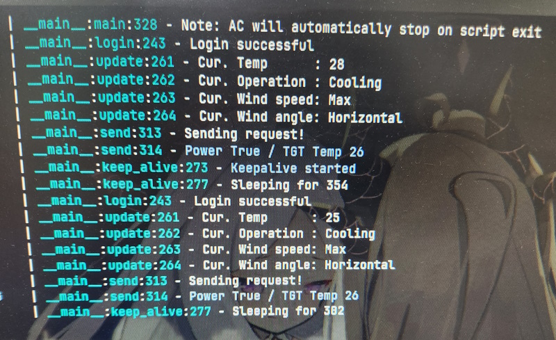

# Hongik Air Conditioner Wall Panel Project

Because they didn't give us the darn remote controller.

*TODO: Put Demo image here*

If you don't need UI - Just download and run `api.py` only.

## Introduction

Project to create Rapsberry Pi powered AC wallpad.

Probably useless to 99.9% of people who arent in Hong-ik university, including myself next year.

## How to use

git clone this and run `__main__.py`. Pretty sure this won't work right now, will need to test-run at university next week.

Check [this post](https://forums.raspberrypi.com/viewtopic.php?t=238060) if you have trouble setting up SPI display.

## Requirements

- [goodTFT 3.5" SPI Touch display](http://www.lcdwiki.com/3.5inch_RPi_Display)
- Raspberry Pi (Preferably something better than 1B+)
- Raspbian OS
- some dependencies:
  - font  
    `sudo apt install fonts-unfonts-core`
  
  - Pygame 2 dependencies  
    ```
    sudo apt install -y libxrender1 libxss1 libpulse0 libasyncns0 libwayland-cursor0 libflac8 libxfixes3 libwayland-server0 libsdl2-mixer-2.0-0 libjack0 libogg0 libdrm2 libopusfile0 libmodplug1 libsdl2-image-2.0-0 libxrandr2 libgbm1 libvorbis0a libsdl2-ttf-2.0-0 libsndfile1 libxi6 libvorbisfile3 libportmidi0 libxkbcommon0 libwayland-client0 libfluidsynth2 libmpg123-0 libxinerama1 libsdl2-2.0-0 libopus0 libvorbisenc2 libwayland-egl1 libxxf86vm1 libxcursor1 libinstpatch-1.0-2 libffi-dev libbz2-dev liblzma-dev libsqlite3-dev libncurses5-dev libgdbm-dev zlib1g-dev libreadline-dev libssl-dev tk-dev build-essential libncursesw5-dev libc6-dev openssl git libopusfile0 libsdl2-image-2.0-0 libsdl2-mixer-2.0-0 libsdl2-ttf-2.0-0
    ```
    
  - Python Modules
    ```requirements.txt
    trio
    pygame
    httpx
    beautifulsoup4
    loguru
    evdev
    ```

## Backstory

Hong-ik university provides AC interface via web only for club rooms.

But it doesn't last long - site logs out every few minutes, AC stops every few tens of minutes.

Original AC keepalive stuff was made by professors (I guess) long ago, but it uses GUI for no apparent reason, and uses webdriver.

Keeping a headless browser all time, loging in manually everytime to just keep AC working, yet can't even control temps? Meh, that sounds quite bad.

That method lacks flexibility, and requires a huge pain to keep supplying updated webdriver as your PC's browser updates.

Even more about the GUI where it's role ends immediately after typing in AC PW, ID and hit Login button - no temp, wind strength, wind angle control.

To mitigate this, I reverse-engineered their API by looking at `HTML` + `js` code and made my own script that takes command line arguments instead.


(Forgot who was the author of this image, lemme know!)

works well, just open up script shortcut and bam, it does it's job.

Spent months after months like that, and now with old RPi 1B+ nowhere to use - I decided to make this into a AC wall pad.

 (Which was a huge mistake), and had to go through so many troubles.

Namely...

## Troubles when developing this 

1. GoodTFT being 'Neva-fix' on their SPI display driver
2. RPi 1B+'s terrible wheel support (as it's decade old now, ARMv6, 32bit)
3. RPi 1B+'s terrible speed (BCM2835 Single core 700MHz)
    - Every pip install lead to Wheel build due to outdated architecture, and this takes years
    - Forced to use Python3.11 due to performance, hence need to compile python 3.11
    - Pygame piwheel only support up to python 3.9.5, building it take day
    - Even X server is way too heavy for system, takes minutes to load a setting GUI.
      - Had to re-invent every wheel that doesn't rely on X server

... and so on. There's way, way more trouble than this looks like.

Basically this struggle is mainly about factor 3, terrible performance.

If we have enough performance then we could just use X server and use GUI tools available.

But no, Pi B+ is terribly slow in today's standard - so I had to go for directly writing to framebuffer.

That means I need to make framework for:
- reading touch input events
  - touch_driver
- writing to framebuffer
  - framebuffer_driver
- custom UI framework that could accommodate above 2
  - basic_ui_framework

And bam. Basically had to learn so many things to achieve those.
