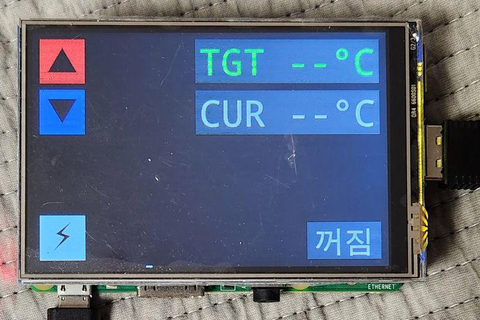

### Basic UI framework
This is so basic, that it's maybe below primitive.

Designed with Frame Buffers in mind, where usual input detection can't work.

Currently only support:
- Box
- TextBox(Box)
- TextButton(TextBox, ButtonMixin)

and ImageBox in-plan, which will automatically allow ImageButton too.

And you're free to add what you want

### Demo

Has some issue with display, so color is kinda mess

